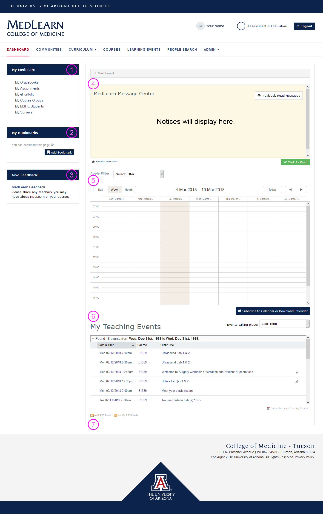

#MedLearn - Dashboard

The dashboard is displayed by default when logging in to MedLearn. If you navigate away from the dashboard, simply click on the MedLearn logo or the dashboard link to return to it.

## My MedLearn (1)

Currently My MedLearn's primary use is for students, thus not all links will work for faculty and staff. My MedLearn provides students with quick access to commonly used areas of MedLearn. Additionally, Societies Mentors will access their MSPE students by clicking on My MSPE Students within My MedLearn.  

## My Bookmarks (2) 

My Bookmarks allows users to create custom quick links specific to their user account. If you frequently are going to the same page, you can add it as a bookmark, or if you want to remember to return to a certain page in MedLearn you could add it as a bookmark as a reminder, then delete it once you are finished. Your bookmarks are unique to your account, so no one else can see what you have bookmarked in MedLearn.

## Give Feedback (3) 

Faculty and Staff are able to submit feedback for IT, while students are able to provide IT feedback and anonymous course feedback. IT feedback might include a suggestion or a bug/issue you've identified.

## MedLearn Message Center (4)

Faculty and staff are able to post messages containing important reminders, notices, announcements, etc. to specific audiences. While most notices will likely be directed towards students, they can also be targeted towards faculty, staff, or residents within MedLearn. Once posted, messages are shown on the dashboard within the MedLearn Message Center. Unread messages display by default when you view the dashboard. You can also mark messages as read so that they no longer appear. If you want to review previously read messages click on Previously Read Messages. 

## Calendar (5)

By default, faculty will see events on their calendar in which they are associated with either as an author, editor, lecturer, or faculty. Staff will see events on their calendar for courses they are associated with (i.e. assigned to as the coordinator). To change what displays on your calendar, you can apply and remove filters to either get a more general calendar or more specific calendar. 

Note that students do not have the ability to apply and remove filters. They are only ever able to see events on their calendar for courses they are enrolled in and an audience of the event. 

By clicking on an event on the calendar you can view event details (e.g. location, duration, attendance requirements, etc.) and resources.

* The calendar defaults to the current week
* Refer to the date range field
* Use the arrows to select past and future dates
* Apply filters to change what shows on your calendar
* Click on the event to review event details
* Click on the Event Resources link to access learning materials

## My Teaching Events (6)

The My Teaching Events table shows faculty a list of events in which they are associated with either as an author, editor, lecturer, or faculty. Staff will see a list of all events for courses they are associated with (i.e. assigned to as the coordinator). Click on an event to view the event's details. 

## RSS Feeds (7)

If you have a favorite website who posts or content you follow, you can add their RSS feed to your MedLearn dashboard. RSS feeds added to the MedLearn dashboard are unique to the user who added them. 

**What is an RSS?**

"RSS (Rich Site Summary) is a format for delivering regularly changing web content. Many news-related sites, weblogs and other online publishers syndicate their content as an RSS Feed to whoever wants it." _(Source: [http://www.whatisrss.com/](http://www.whatisrss.com/))_