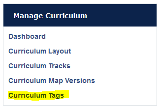
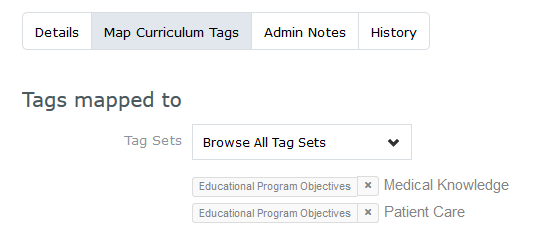
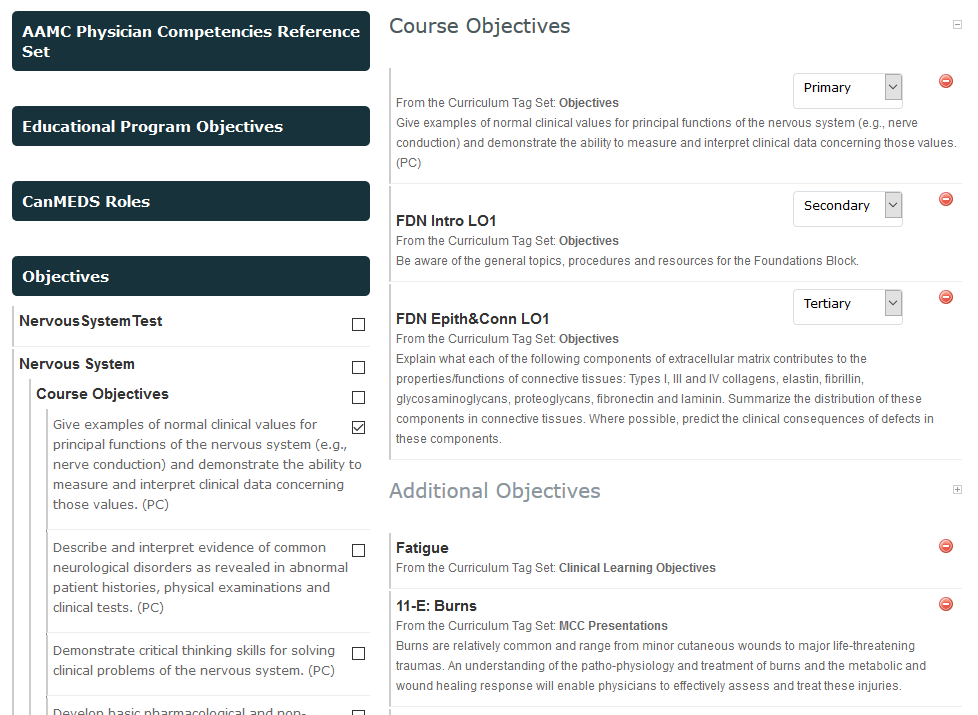
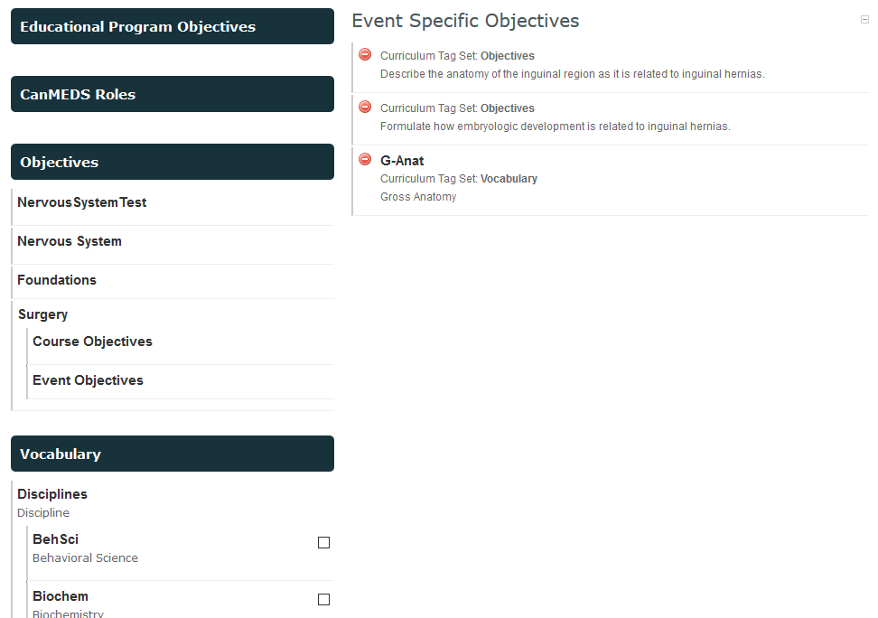

#MedLearn - Curriculum Tags

MedLearn has the ability to map tags to courses, learning events, assessment/evaluation items, and to other tags. 

By navigating to **Admin / Manage Curriculum** then selecting **Curriculum Tags** in the left side menu, you will see a list of available taxonomies for tagging. 

**Note:** MeSH terms are not "housed" within Curriculum Tags. They are stored separately in the database. 

You can add a new taxonomy by clicking on **Add Tag Set**. To add additional tags to an existing taxonomy, click on the title of the tag set you want to add to, then you can add a tag.  

## Organization of Course, Event, and ILM Objectives

The UA COM-T's learning objectives are within the **Objectives** tag set. The are organized in the following structure:

* Objectives
    * Course Name
        * Course Objectives
            * The actual objective...
        * Event Objectives
            * Event Title
                * The actual objective...
        * ILM Objectives
            * ILM Title
                * The actual objective

Additionally, the objectives are linked to their appropriate competency. To view the linked tags, click on the link icon that appears when you hover over the objective. A window similar to the following should appear:

You can also add **Admin Notes** to objectives. These notes are only visible to administrators. 

## Organization of Vocabulary

The Vocabulary tag set is organized in the following manner:

* Vocabulary
    * Disciplines
        * The specific disciplines
    * Threads
        * Evidence-Based Medicine
            * The specific threads
        * Health & Individual
            * The specific threads
        * Health & Society
            * The specific threads

## How To Tag Your Course Objectives

1. Navigate to Admin / Manage Courses / Select Your Course / Setup Tab
2. Scroll down to the Objectives and Tagging section
3. Click **Show Curriculum Tag Sets**
4. Click through the tag sets following the organization mentioned above to find your course objectives
5. Click the checkbox next to each course objective you want to attach to the course
6. Repeat the above steps with the Vocabulary tag set (if applicable)

You will notice that tags from the tag set **Objectives** sort to the sub-section titled **Course Objectives**, while tags from any other tag set sort to the sub-section titled **Additional Objectives**. 

Within the **Course Objectives** sub-section, you can also further specify which objectives are primary, secondary, or tertiary. 

Click save at the bottom of the page when you are done. 

## How To Tag Your Event Objectives

1. Navigate to Admin / Manage Events / Select Your Event / Content Tab
2. Scroll down to the Event Objectives section
3. Click on **Map Additional Objectives**
4. Navigate to the Objectives or Vocabulary tag set to find the objectives relevant to your event
5. Click the checkbox next to the tags you want to attach to the event, the tags will appear in a new sub-section titled **Event Specific Objectives**

Click save at the bottom of the section when you are done. 

## What if I have a brand new objective?

1. Go to Admin / Manage Curriculum / Curriculum Tags
2. Select the tag set you want to add the objective to (e.g. Objectives / Course Name / Course, Event, or ILM Objectives / Etc.)
3. Click **Add Tag**

Return to the course, event, or ILM that you want to attach the new tag to and follow the steps outlined in the previous sections. 

## What if I need to edit an objective?

First, is the edit a **minor** change (e.g. changing the leading verb)? If so, go to Admin / Manage Curriculum / Curriculum Tags / Navigate through the tag sets to find the objective, and finally click the pencil icon that appears when you hover on the tag to edit it. 

If it is a **major** change/content change, detach the old objective from the course/event/ILM, and add a new objective following the steps outlined above for _**What if I have a brand new objective?**_

## What if I need to remove an objective?
If you just need to remove an objective from a course/event/ILM, detach the tag directly from the setup or content tab. Do **not** delete the tag from Manage Curriculum, as that will result in the tag being deleted for past years, too. 