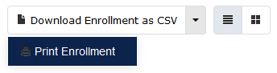
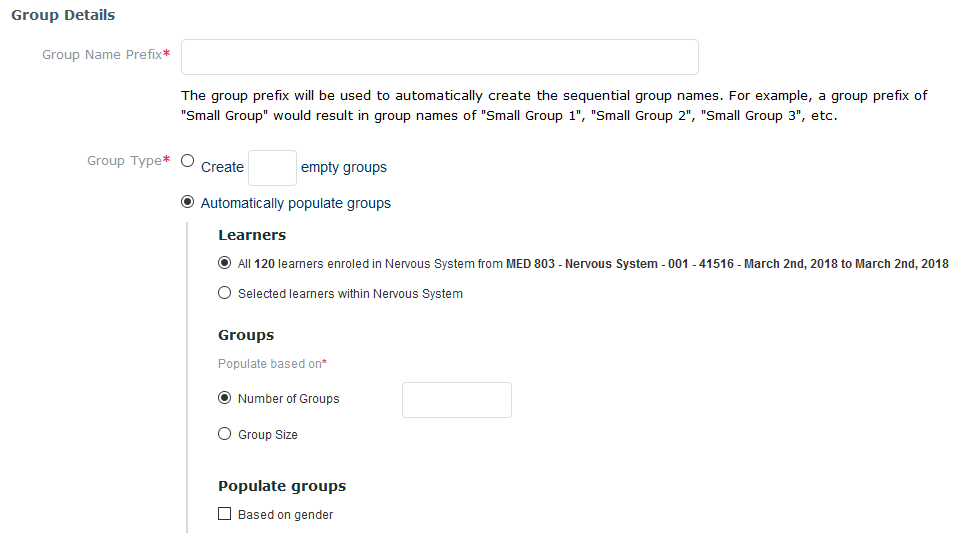
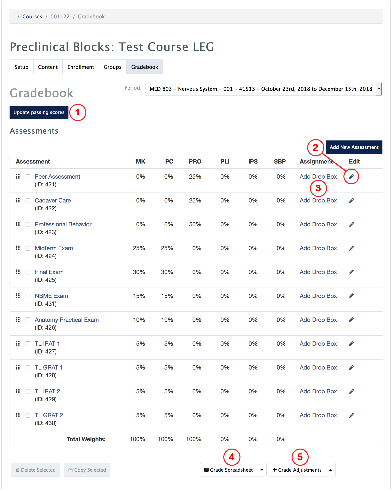
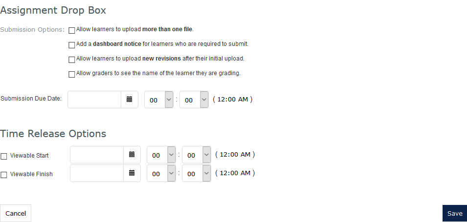
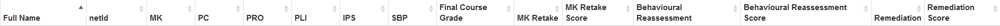
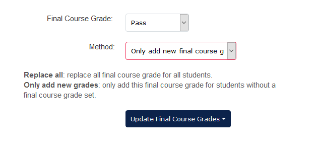

#MedLearn - Managing Courses

In MedLearn, you can navigate to Manage Courses in two ways:

1. Admin / Manage Courses / Select a Course, or
2. Courses / Change Display Style Your Non-Learner View

Once you are in the non-learner view of the course you should see five (5) tabs. 

1. Setup
2. Content
3. Enrollment
4. Groups
5. Gradebook

## Setup

In the setup tab, you specify the details about the course. Details include:

* Course Name
* Course Image (must be 1200px * 250px, this will display on the top of the learner's view of the course)
* Class Number (from UAccess)
* Subject and Catalog Number (from UAccess)
* Course Credit/Units (from UAccess)
* Course Type (core/required or option/elective)
* Course Contacts (e.g. Director, Coordinator, etc.)
* MeSH Terms
* Course Objectives and Additional Objectives (e.g. Vocabulary)
* Academic Level(s) 
* Curriculum Layout
* Curriculum Period
* Audience
* Various Course Options

## Content

In the content tab, you can provide students with information and resources about the course. Information and resources can include:

* Course Description
* Director's Message
* Files
* Links

## Enrollment

You attach the course audience / enrollment within the setup tab, but you are able to view a list of enrolled students in the enrollment tab. This list also provides you with the student's email address. You can download the class list as a CSV. Additionally, you can print the list or toggle between a list view or grid view. 

## Groups

In the groups tab, you can create small groups (e.g. TL, CRC, Lab, Societies). You can manually create the groups within MedLearn, or import a CSV of your groups. 

When adding groups manually, you have the option to auto-populate groups, or create empty groups and populate them manually. 

## Gradebook

### Update Passing Score (1) 

To set the minimum score to earn a passing score, click on the **Update passing score** button. You can then edit passing scores, and enter the score needed for each competency. If your course is not assessing all competencies you can enter the passing score for just the competencies you are assessing. 

### Add New / Edit Assessment (2)

To add a new assessment click on the **Add New Assessment** button on the main screen of the gradebook. A form will appear. At a minimum you will need to enter the following information:

* Assessment Name
* Competency Weights
* Characteristics 
    * _**Note:** If the grades are coming from a distribution from the assessment & evaluation module (i.e. from a survey), make sure you select the characteristic carefully, as this will determine how grades are calculated._
* Marking Scheme
* Assessment Type
* Show Grades Starting

You can also edit an existing assessment by clicking the pencil icon in the row of the assessment you want to edit. The same form appears as when you are creating a new assessment. 

### Add Drop Box / Uploadable Assignment (3) 

After you create an assessment, you have the option to make it a drop box / uploadable assignment. This will allow students to upload a file for grading. Various options will be available when you are creating the drop box / uploadable assignment. 

### Grade Spreadsheet (4) 

#### View / Edit Grade Spreadsheet

To view student grades for each competency click on the arrow to the right of the **Grade Spreadsheet** button, then click on **View / Edit**. A table will appear displaying a row for each enrolled student, and a column for each competency and final course grades.  

You can click on the student score for each competency to view a grade breakdown by assessment. 

Additionally, you can click on the cell for the Final Course Grade, MK Retake, MK Retake Score, Behavioral Reassessment, Behavioral Reassessment Score, Remediation, and Remediation Score to enter the student's earned scores. 

#### Apply Final Grade

To apply a final course grade to all students, click on the arrow to the right of the **Grade Spreadsheet** button, then click on **Apply Final Grade**. This allow you to apply the same grade to all students. 

For example, you might want to apply pass to all students using the method "Replace all final course grades", then go to view/edit the spreadsheet to manually adjust the students that received an incomplete or fail for their course grade. 

Alternatively, you can first manually enter the incompletes/fails, then apply a final grade to all with the method selected as "Only add new final course grades". 

### Grade Adjustments (5)

To apply a positive or negative grade adjustment on a competency for a student, click on the arrow to the right of the **Grade Adjustments** button, then click on **View / Edit**. 

In the window that popped-up, start typing the student's name in the textbox, then click on the name once it appears and click the **add adjustment** button to the right. A row will appear in the table above. 

Select the competency you are adjusting, enter the percentage (Format Example: -10 will deduct 10%, 5 will add 5%), and enter the reason for the adjustment. Close the pop-out window to save and return to the main gradebook screen. 

### Entering Grades

* **Manual Entry**
    * To manually enter grades for each student for an assessment, click on the assessment name on the main gradebook screen. Then with your mouse click in each cell next to the student's name to enter the score. You will have to click on each cell with your mouse, as tabbing with your keyboard does not currently work. 
* **Import from ExamSoft / NBME / Generic CSV**
    * Download the CSV from ExamSoft, then click on the name of the assessment you want to import scores for in MedLearn on the main gradebook screen. Click the green **Import Grades** button, then choose the file you just exported from ExamSoft. 
    * You can also import NBME grades. Click on the name of the assessment you want to import scores for in MedLearn on the main gradebook screen. Click the green **Import Grades** button, then choose the file you received from NBME. 
    * You can also import "generic" CSVs (i.e. you created the spreadsheet in Excel). Just make sure it is formatted correctly based on the guidelines specified in MedLearn. The formatting is shown when you click the green Import Grades button. 
    * _**Note:** If you already have grades entered for the assessment you are working on, you can select the option to replace all grades, or replace with the higher score. _
* **Import from Assessment & Evaluation Distribution**
    * Several prerequisites are necessary for this to work properly:
        * You must have selected the correct characteristic when setting up the gradebook assessment so that MedLearn knows how to score the assessment. 
        * You must have tied the gradebook assessment to the assessment & evaluation distribution when setting up the distribution. 
        * Once the assessment & evaluation tasks/surveys are completed you can click on the name of the gradebook assessment, then click on Import from Distribution. 