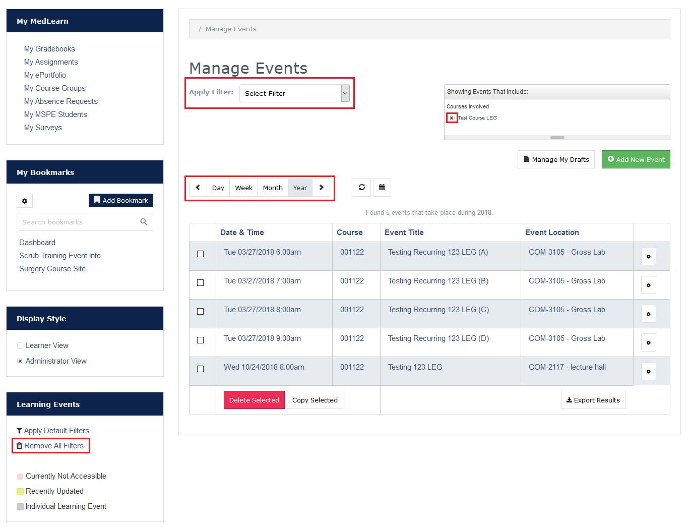
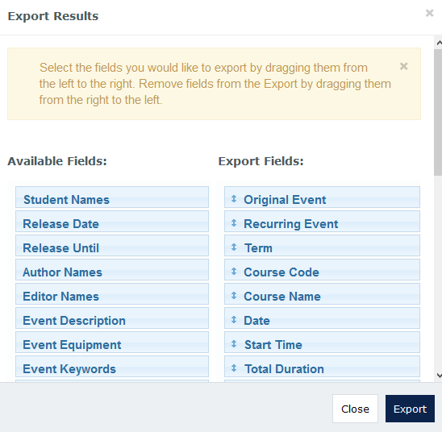
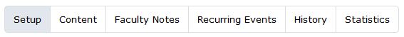

#MedLearn - Managing Events

## Learning Events Main Page

To navigate to the main learning events page you can go to:

1. Admin / Manage Events, or
2. Learning Events / Change Display Style to Your Non-Learner View 

### Filtering Display

There is an **Apply Filter** dropdown at the top of the learning events page with various filters. By applying or removing filters you can get a list of events relevant to the work you are doing. Additionally, you can apply multiple filters. 

To remove a filter click the **X** next to the filter in the "Show Events That Include" box. 

To remove _all_ filters click on **Remove All Filters** on the left side of the screen. 

Additionally, you can sort your list to display events by day, week, month, or year and toggle between your choice with the left and right arrows. 

### Deleting an Event

If you need to delete an event, go to Admin / Manage Events. Select the checkbox next to the event you want to delete, then click the red **Delete Selected** button. 

### Copying an Event

If you need to copy an event, go to Admin / Manage Events. Select the checkbox next to the event you want to copy, then click the white **Copy Selected** button. 

### Export Results

On the Manage Events page of MedLearn you have the option to Export Results. This allows you to generate an Excel spreadsheet with various event details. You can specify what details you want by dragging fields to and from **Available Fields** and **Export Fields**. 

## Managing a Specific Event

In MedLearn, you can navigate to manage an event in three ways:

1. Admin / Manage Events/ Select an Event, 
2. Learning Events / Change Display Style to Your Non-Learner View / Select an Event
3. Learning Events / Select an Event / Change Display Style to Your Non-Learner View

Once you are in the non-learner view of the event you should see five (5) or six (6) tabs. 

1. Setup
2. Content
3. Faculty Notes
4. _Recurring Events (only shows for events with multiple offerings/recurrences)_
5. History
6. Statistics

### Setup

In the setup tab you will need to specify the following:

* Course: The course the event belongs to
* Enrollment Period: The period of the course in which the event belongs to
* Event Title
* Event Date & Start Time
* Event Location (Building and Room)
* Event Type and Duration
* Associated Faculty
    * Author: If the event is new, this is the person who created the materials for the event
    * Editor: If the event is from a prior year, this is the person who edited/maintained the materials for the event
    * Lecturer: This is the person in the classroom teaching
    * Faculty: Includes additional faculty (e.g. lab prep) and facilitators (e.g. CBI/CRC)
* Options
    * If the audience of the event should be visible to the learners
    * If attendance is required
    * If the event is podcasted
    * If professional dress is required
    * If the event is flipped
    * If the event is a clinical correlation
* Event Equipment: Anything the student might need to bring to class (e.g. iPad, laptop, pen/pencil, etc.)
* Associated Learners: All learners or a custom audience (e.g. small group)

### Content

In the content tab you will be able to add the following details:

* Event Description
* Student Information (e.g. notes to the student)
* Event Keywords (MeSH)
* Event-Specific Objectives and Vocabulary
* Event Resources (e.g. lecture notes, slides, readings, etc.)

### Faculty Notes

Faculty Notes are only visible to faculty. These might be reminders about changes in teaching faculty, or notes that tagging has been reviewed. Anything that you want to keep track of, but don't want students to see. 

### Recurring Events

If an event has multiple offerings, the recurring events tab will display. This lists all offerings of the event. When editing recurring events you can perform edits on the full series, or on each event individually. 

### History

This tab shows a history of anyone who created or edited the event. 

### Statistics

This tab shows who statistics on who has viewed the event, and how many times the event has been viewed. 