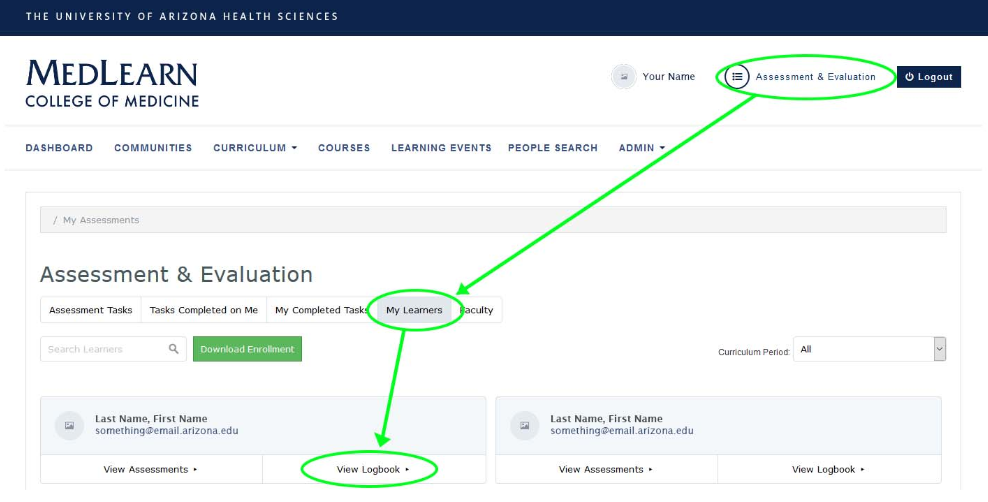
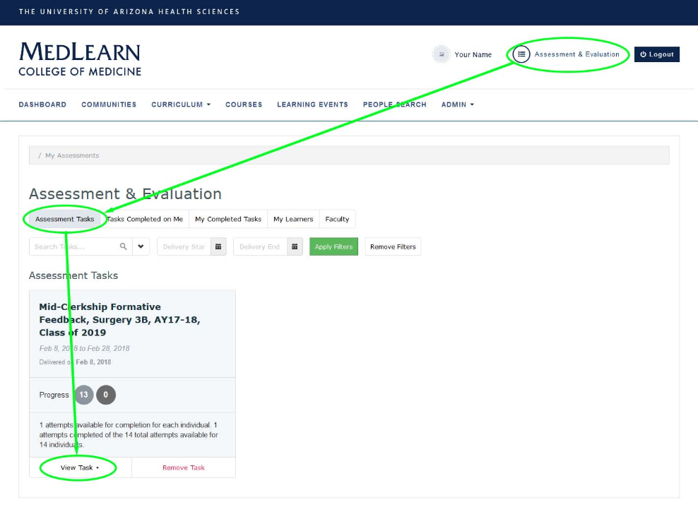
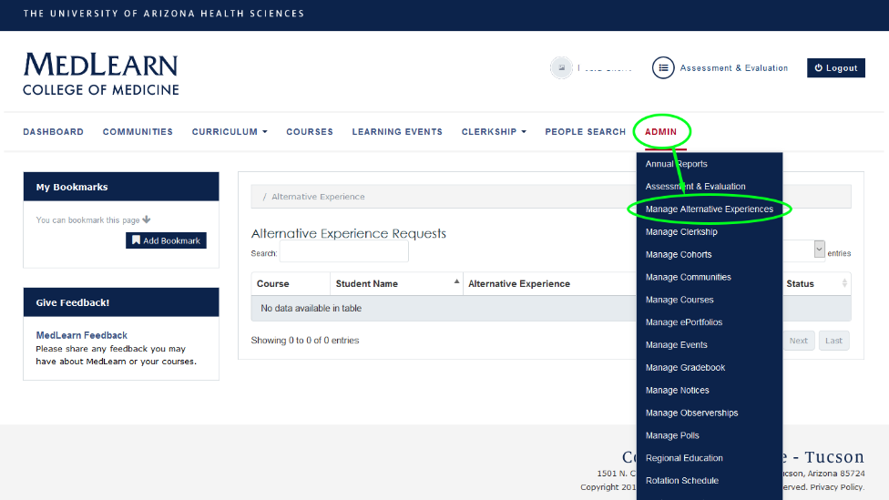

# MedLearn - Clerkship Components

## Patient and Procedure Logbook

To review all logged cases and procedures for a specific student:

* Go to **Assessment & Evaluation** in the top right corner by your name
* Click on the **My Learners** tab
* If a student has logged entries in their logbook, you should see two options under each student's name (View Assessment and View Logbook)
* Click on **View Logbook** for the student you are wanting to see entries for
* Upon clicking View Logbook you should see a screen titled **Encounter Tracking Entries (Last Name, First Name) and a list of logged encounters for that student

You will be able to view additional information by using a couple reports in MedReports. 

### Report: Clerkship Logbook Overview

This report shows the number of objectives (e.g. cases and procedures) logged for a clerkship by student, and a sum of the total number of objectives logged for the clerkship. 

### Report: Logged Cases and Procedures by Student

This report shows the specific cases or procedures (objectives) logged by clerkship students in the logbook for a specific clerkship. 

## Duty Hours Tracking

To review duty hours entered by students you will need to go to MedReports. 

### Report: Duty Hours Compliance

The Duty Hours Compliance report details the average number of hours logged by student, the current week's hours logged by a student, and a summary of all logged duty hour encounter dates. 

## Mid-Clerkship Formative Feedback

The Clerkship Coordinator can complete the Mid-Clerkship Formative Feedback form in MedLearn. 

1. Go to **Assessment & Evaluation** at the top right by your name. 
2. Click on **View Task** under the correct Mid-Clerkship Formative Feedback task. 
3. Under **pending targets** select the student whose form you want to complete. 

### Report: Mid-Clerkship Formative Feedback

A report showing all the students mid-clerkship formative feedback information. 

## H & P Clerkship Feedback

Students will complete their H & P Clerkship Feedback form through the Assessment & Evaluation module of MedLearn. The Clerkship Coordinator will be able to review the results by going to the HP Feedback Completion report in MedReports. 

### Report: HP Feedback Completion

The HP Feedback Completion report shows an overview of students by clerkship and when they performed a history and physical, who observed them, and what the observer's role is (e.g. attending, fellow, or resident). 

## Alternative Experience Requests

Students are able to request alternative experiences through MedLearn. Following a student's request, the Clerkship Coordinator can go to Admin / Manage Alternative Experiences to approve or deny the request. 

If approved, the student will then log the alternative experience in the logbook. 

If denied, the student will be required to complete the originally prescribed experience. 

### Report: Alternative Experience Requests

This report allows you to view a summary of all alternative experience requests, sortable by student, course, alternative experience, and status. 

### Report: Alternative Experience Requests by Site

This report allows you to view a summary of all alternative experience requests by site. 