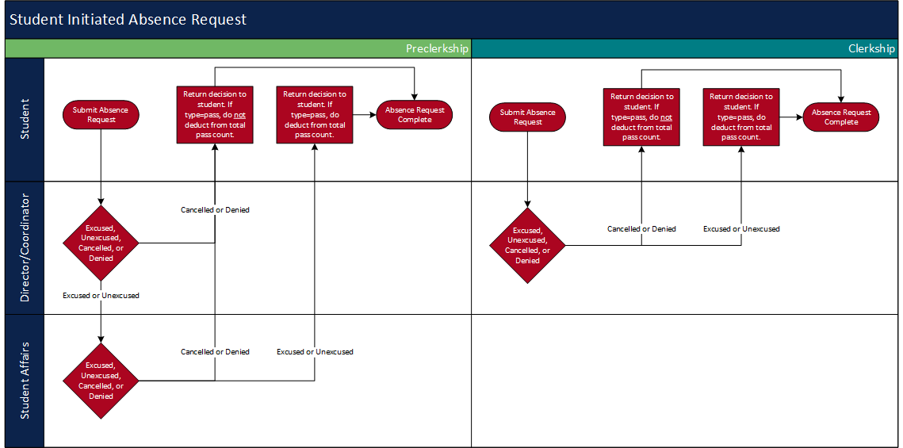
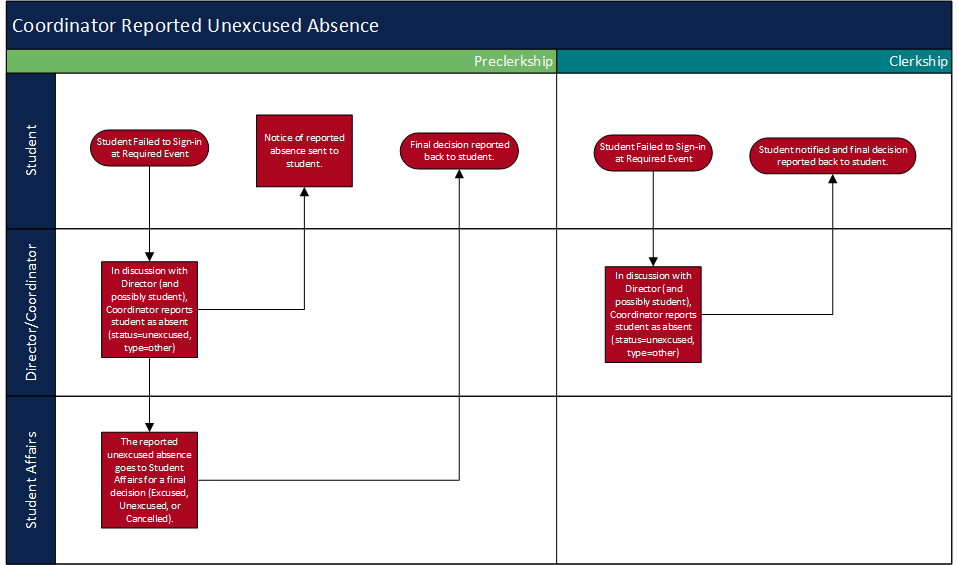

#MedLearn - Absences

Once a student has requested an absence, the request will be directed to the Course Coordinator and Director. For clerkships, this will be the only and final step for approval/denial of the request. For preclerkship courses this will be the first or two steps for approval/denial. The second and final step for preclerkship courses will be Student Affairs. 

Additionally, coordinators and directors are able to report a student absent, for example if they do not sign in at a required event. 

In general, this is how you process an absence request in MedLearn:

1. Go to **Admin / Manage Absences**.
2. To manage a pending absence request make sure the **Pending** tab is selected. To review a previously approved/denied request go to the **All Requests** tab. 
3. Click on the gear icon under **Actions** for the request you want to manage.
4. Click **Edit** to change the status of the request. 
    * Statuses include:
        * Excused Absence
        * Unexcused Absence
        * Pending (Default)
        * Cancelled
        * Denied
5. Add any comments. 
6. Click **Save**. 

Below are the flowcharts for student requested absences and coordinator reported absences. 

