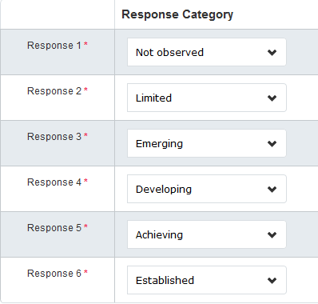
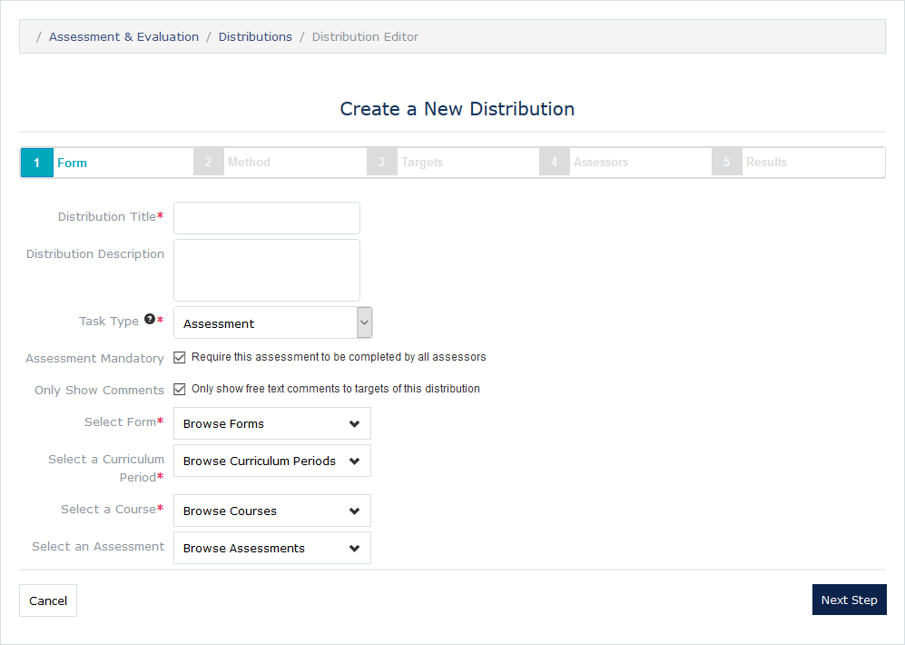
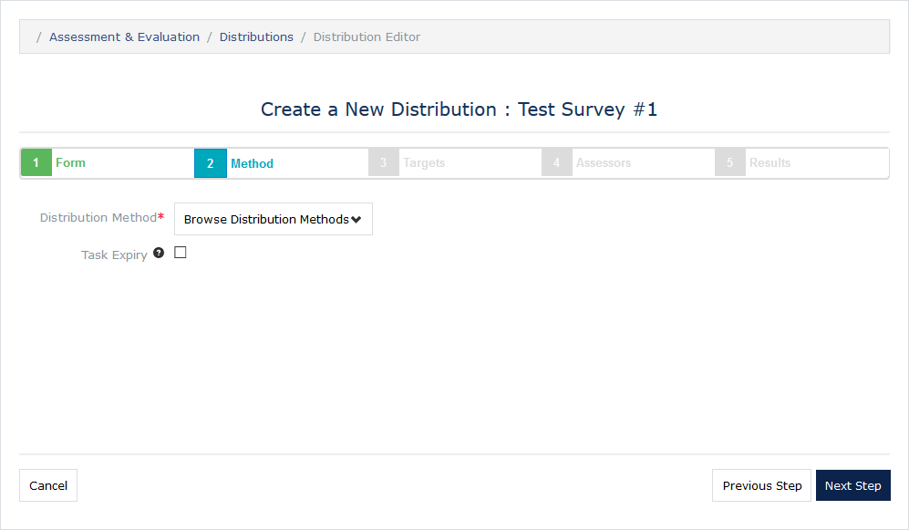
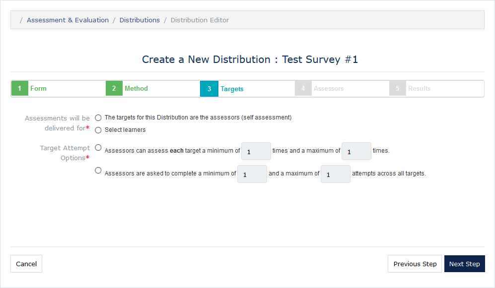
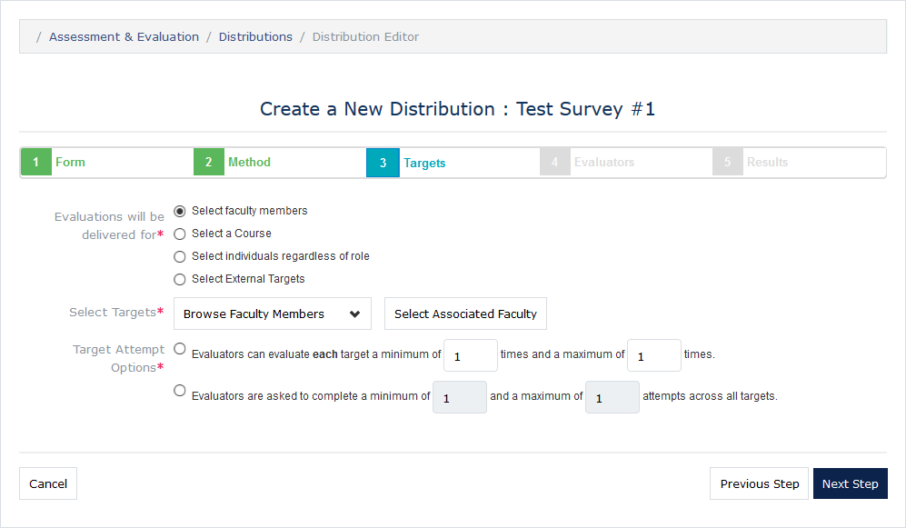
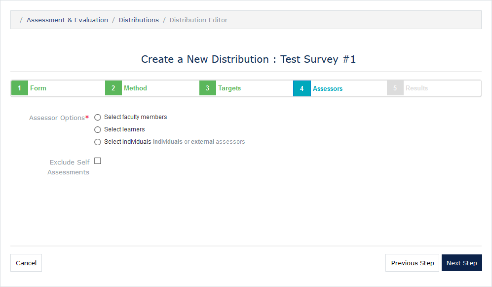
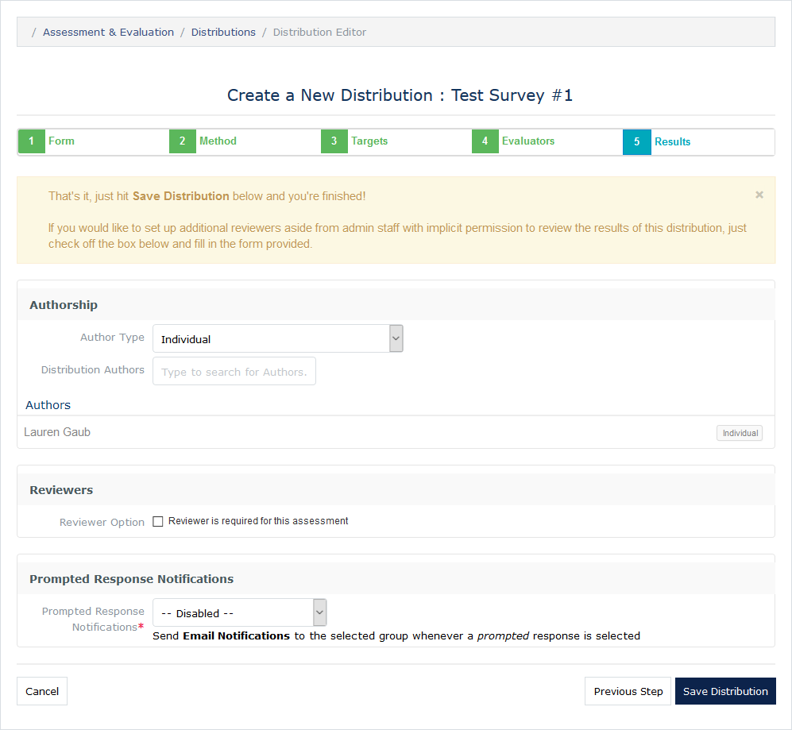

#MedLearn - Manage Assessments & Evaluations (aka Surveys)

To manage assessments and evaluations, click on **Admin / Assessment & Evaluation** _(**Note:** this is not the same as the Assessment & Evaluation link next to your name)_. 

General Steps for Creating a Survey:

1. Create items
2. Create a form and attach the items created in step 1
3. Create a distribution using the form created in step 2. 

## Dashboard

The dashboard of the Assessment & Evaluation module shows outstanding, upcoming, and deleted tasks for assessments and evaluations. First select **Assessments** or **Evaluations**, then select **Outstanding**, **Upcoming** or **Deleted**. 

* **Assessments:** Generally the student is the target, and it contributes to the student's grade. 
* **Evaluations:** Typically someone/something other than students is the target. For example, the target could be a faculty member, a course, or an event. 

## Scales

Rating scales establishes default response categories for items. For example, if you are creating five items all with the same response categories, you could use a rating scale to streamline the item creation process. An example of a rating scale is as follows:

## Items

Items are what make up forms. You can create individual items or grouped items. Individual items are independent of any other questions on the form. Grouped items establish a rubric with common response categories, but multiple unique item text. 

When creating an item you can choose from a variety of item types including the following:

* Horizontal/Vertical Multiple Choice (Single or Multiple Response)
* Dropdown (Single or Multiple Response)
* Free-Text Comments
* Date Selector
* Numeric Field
* Rubric Attribute
* Scale Item

Additionally, you will need to provide:
* The item text (what the assessors/evaluators are answering/responding to)
* An item code (optional)
* A rating scale (optional)
* If the item is mandatory or optional
* If comments are allowed for the item, and if they are required or optional
* If a default value should be selected/provided
* The item responses and corresponding text, value, and category

Finally, you can associate a curriculum tag to the item. For graded items you **MUST** tag the corresponding competency so that the gradebook knows which competency the score contributes to when importing scores from an Assessment & Evaluation distribution. **_See Gradebook Section for more information._**

## Forms

Once you've created your items, you can now create a form. When you click the green **Add Form** button you will be prompted to enter the Form Name and Form Type. You will then be redirected to the form creation page. You can add a form description, items, grouped items, free-text, and curriculum tags. 

Once items have been added to the form you can download a PDF of the form, preview the form, or copy the form. 

## Distributions

To actually send the form out for assessors/evaluators to complete, you will need to create a distribution.

### Step 1: Form

### Step 2: Method

### Step 3:  Targets

_Options vary based on if assessment or evaluation was selected in Step 1._

#### Assessments

#### Evaluations

### Step 4: Assessors/Evaluators

_Options vary based on if assessment or evaluation was selected in Step 1._

#### Assessments

#### Evaluations

### Step 5: Results

