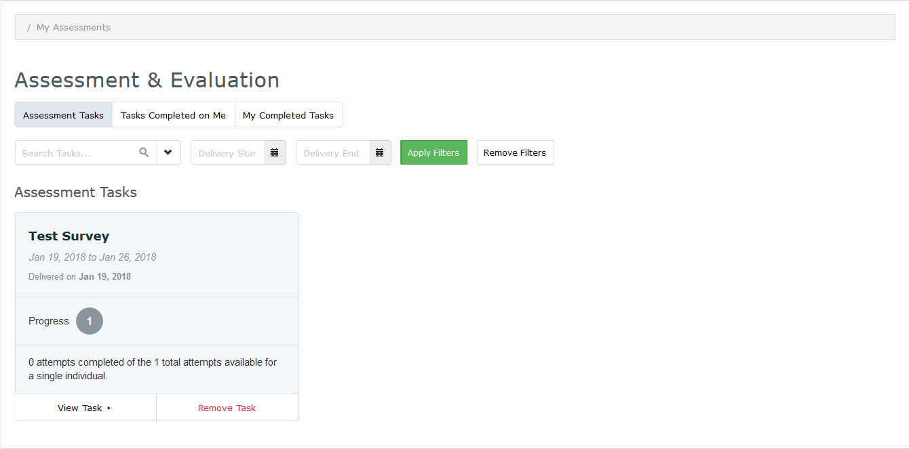

#MedLearn - Complete Assessment & Evaluation Tasks (aka Surveys)

When you click on Assessment & Evaluation at the top right corner of the screen, you will be able to complete assessment tasks, view tasks completed on yourself, and view your previously completed tasks. 

## Assessment Tasks

If you have any surveys to complete they will be listed under Assessment Tasks. To complete the survey click on View Task. A task might have multiple targets, so one task might actually involve completing multiple surveys. Complete the survey form then hit Submit when you are done.

## Tasks Completed on Me

Depending on the type of assessment, you might be able to view the results of a survey completed on you by clicking on Tasks Completed on Me. Some results might show the entire form, while others might only show you the free text comments written about you. 

## My Completed Tasks

To review past surveys you filled out, click on My Completed Tasks, then View Task for the survey you want to review. Completed tasks are not editable. 