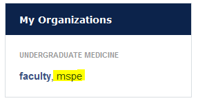
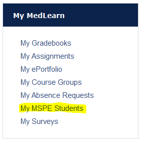

# MedLearn - MSPE

## MSPE - Societies Mentor Paragraph

Once logged in to MedLearn, select the MSPE role under My Organizations.

Then click on My MSPE Students under My MedLearn. 

A list of students that you mentor will appear. Click on the student's name to enter your paragraph, then click **Save Changes** when you are finished. 

Additionally, you can toggle your display between **Show all students** or **Show only students requiring attention**. 

## MSPE - Student Affairs Deans / Letter Writers

Once logged in to MedLearn, select the MSPE role under My Organizations.

Then go to **Admin / Manage MSPEs**. 

Select the cohort you want to manage in the dropdown, then click **proceed**. 

Once you are in a cohort, you will be able to define the **MSPE Options** under the MSPE Admin section towards the left of the screen. In this section you will be able to set the convocation date and the submission deadline for students to submit their noteworthy characteristics. 

Returning to the **MSPE Main** screen, you will be able to work on editing and approving individual student's MSPE letters. Students are organized by house. Additionally, you can toggle your display to **Show only students requiring attention** or **Show all students**. 

Click on the student name to edit their letter. While editing the student's letter, you can generate a preview of what the letter will look like. Then once all sections are approved, you will be able to generate a PDF of the MSPE letter. 