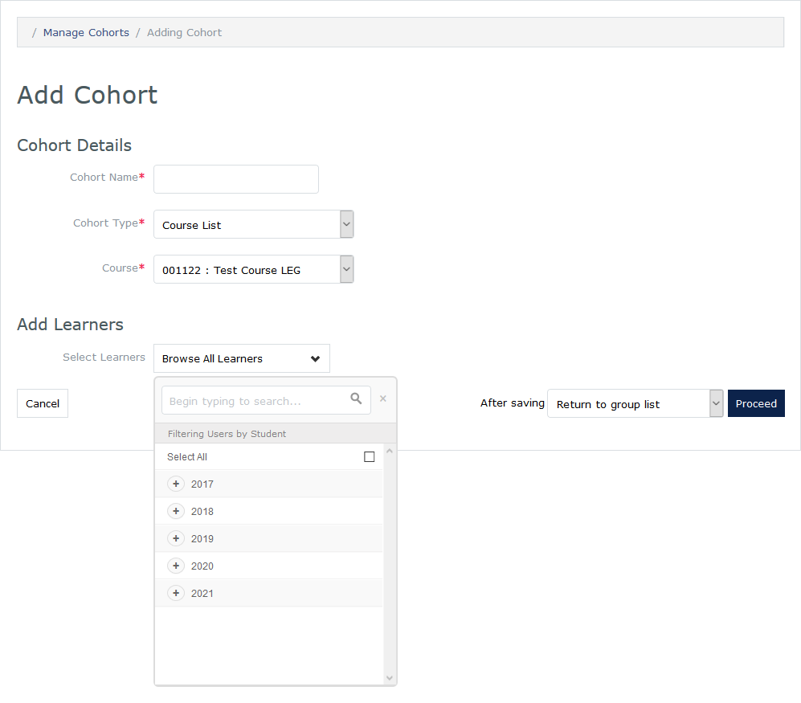

#MedLearn - Manage Cohorts / Course Lists

To be able to enroll students in a course, you must first create a course list. To create a course list navigate to **Admin / Manage Cohorts**. 

You can manually create the class list in MedLearn, or import from a CSV. To import from a CSV, click on **Import / Export** then click  **Import Cohorts from CSV**. A sample file is available to download for reference. 

To manually create a class list, click on **Add New Cohort**. Then enter the name, type (Course List), the course the list is associated with, and select the learners you want to enroll in the course. 

Once the course list is created, you can attach it to the course within the setup tab.