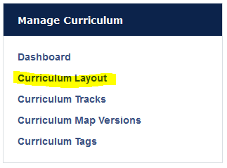

#MedLearn - Curriculum Layouts and Periods

To define the layout a course belongs to, you will need to create a curriculum period (within the corresponding curriculum layout), and attach the curriculum period to the course in the course setup tab. 

To create a curriculum period navigate to **Admin / Manage Curriculum**. Then click on **Curriculum Layout** in the left side Manage Curriculum menu. 

Select the curriculum layout you want to create a period for by clicking on the name. 

You will then see a list of all the existing periods for that layout. To add a new one click on **Add Curriculum Period**. A new row will appear at the bottom of the list. 

Enter the start date, finish date, title, grad year, academic year, and term. Click save to finish. 

The curriculum period will now be available to attach to a course within the course setup tab. 